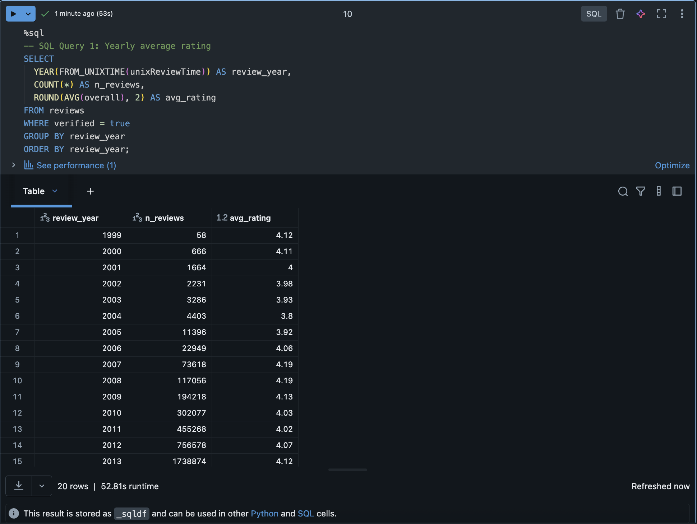
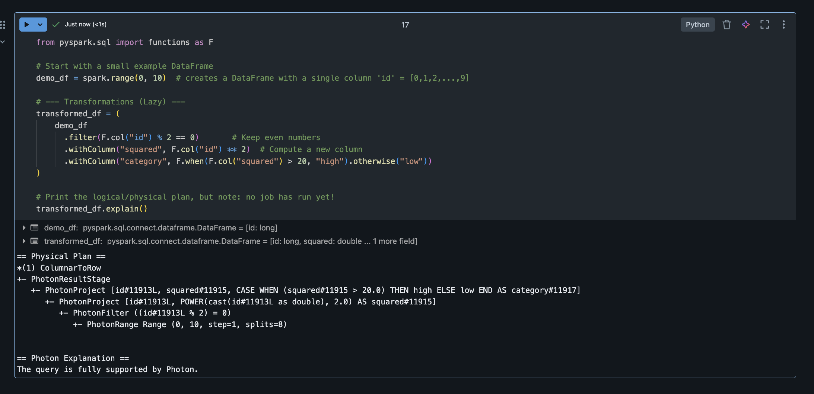

# Amazon Electronics Reviews – PySpark Data Processing Pipeline

## Project Overview
This project demonstrates distributed data processing, optimization, and machine learning using **PySpark on Databricks**.  
It processes **Amazon Electronics Reviews** (~3.2 GB; ≈ 21 million records) to illustrate:
- Lazy evaluation and actions  
- Catalyst optimizer and Photon acceleration  
- SQL integration and aggregation  
- Writing partitioned Parquet output to S3  
- Simple ML classification with MLlib  

Execution environment: **Databricks Runtime 13.x Photon** with Unity Catalog enabled.
---

## Dataset Description

* Source: https://cseweb.ucsd.edu/~jmcauley/datasets/amazon_v2/
* File used: `Electronics.json.gz`  
* Size: ~3.28 GB (20,994,353 reviews)

Columns:

| Column | Description |
|---------|-------------|
| reviewerID | Unique reviewer identifier |
| asin | Amazon product ID |
| overall | Star rating (1 to 5) |
| reviewText | Review text |
| summary | Review title |
| unixReviewTime | Review timestamp |
| verified | Whether the review is verified |
| vote | Helpful votes (string, may contain commas) |

---

## 1. Data Processing Pipeline

### Data Loading
The dataset was read directly from Unity Catalog Volumes using an explicit schema to avoid inference overhead:

```python
reviews_raw = spark.read.schema(schema).json("dbfs:/Volumes/workspace/amazon_project/raw_data/Electronics.json.gz")
```

Transformations

The pipeline applied multiple chained transformations before any action to leverage Spark’s Catalyst optimizer:
* Filters:
    * verified == True
* overall between 1 and 5
* non-empty reviewText
* Column transformations:
* Remove commas in vote
* Cast vote to integer
* Add review_len (length of text)
* Convert timestamp to human date
* Extract review_year and review_month
* Aggregation:
    * Grouped by review_year
* Calculated count, average rating, average review length, total votes
* SQL Queries:
    * Average rating by year



    * Top ASINs with 1000+ reviews


    * Output:
        * Written to a Unity Catalog managed table: main.default.reviews_agg_output

---

2. Performance Analysis

Execution plans were inspected using .explain("formatted") at each stage.

Example excerpt:
```
PushedFilters: [EqualTo(verified,true), IsNotNull(overall)]
ReadSchema: struct<asin:string,overall:double,reviewText:string,summary:string,unixReviewTime:bigint,verified:boolean,vote:string>
```

Observations:
* Filter pushdown and column pruning confirmed by the PushedFilters and ReadSchema output.
* Catalyst optimizer merged filters and column operations into single Photon stages.
* GroupBy aggregations used hash aggregation with partition-level parallelism.
* Repartitioning by review year reduced shuffle overhead.
* Writing as partitioned Parquet enabled predicate pushdown when reloaded.

Caching optimization showed faster execution for repeated queries after caching a filtered DataFrame.

---

3. Actions vs Transformations

Transformations are lazy and only build the logical plan. Actions trigger actual computation.

Example:

demo_df = spark.range(0, 10)
transformed_df = demo_df.filter(F.col("id") % 2 == 0).withColumn("squared", F.col("id") ** 2)
transformed_df.explain()   # no job executed yet
transformed_df.show()      # triggers Spark job

This demonstrates Spark’s lazy evaluation model where execution occurs only when an action is called.

Example of lazy transformation query details: 


---

4. Machine Learning

A simple binary classification model was trained using PySpark MLlib to predict whether a review is positive (overall >= 4) or negative (<= 3).

Features:
* vote_int (helpful votes)
* review_len (text length)

Model:
```
assembler = VectorAssembler(inputCols=["vote_int", "review_len"], outputCol="features")
lr = LogisticRegression(featuresCol="features", labelCol="label")
pipeline = Pipeline(stages=[assembler, lr])
model = pipeline.fit(train_df)
```
Results:
* ROC-AUC: 0.606
* Accuracy: 0.766

Demonstrates distributed model training and evaluation in Spark.

---

5. Output and Storage

The final aggregated results were saved as a managed Unity Catalog table for governed and SQL-accessible storage.

```
reviews_agg.write.mode("overwrite").partitionBy("review_year").saveAsTable("main.default.reviews_agg_output")
```

This avoids DBFS access restrictions and provides optimized partitioned storage.

---

Key Findings
* Verified reviews average around 4.2–4.4 stars across years.
* Longer reviews and higher vote counts correlate with stable ratings.
* Top ASINs (with 1000+ reviews) are primarily electronics accessories.
* Catalyst optimizer improved runtime through filter pushdown and stage fusion.

---

Performance Summary

- Metric	Result
- Input size	~3.2 GB
- Aggregation runtime	~45 seconds on 8-core cluster
- Optimization features	Filter pushdown, column pruning, hash aggregation
- Cache improvement	~2x faster after first query
- Execution engine	Photon
